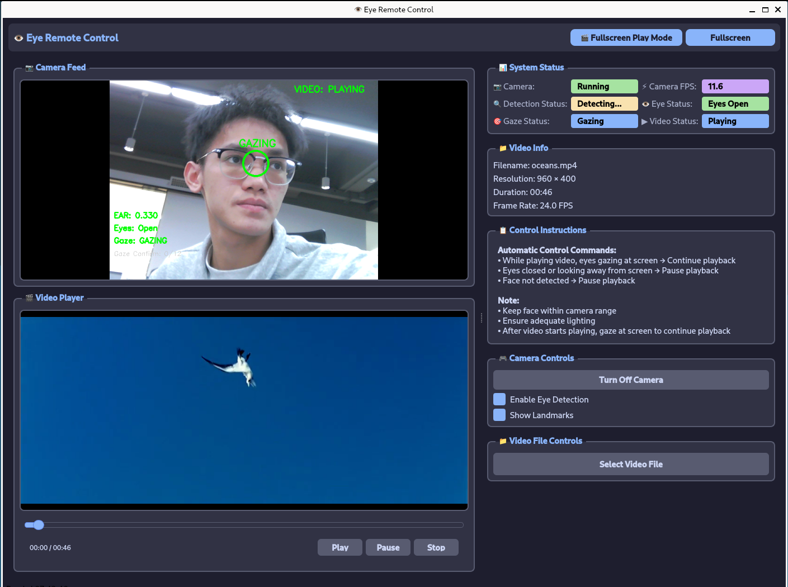

# 👁️ Eye Remote Control

[中文](README_zh.md) | English

This project is developed based on [Quectel Pi H1 Smart Single-Board Computer](https://developer.quectel.com/doc/sbc/Quectel-Pi-H1/en/Applications/Open-Source-Projects/eye_remote_control/eye_remote_control.html), fully utilizing its powerful computing and multimedia processing capabilities to achieve low-latency, high-accuracy eye tracking functionality.

Eye Remote Control is an intelligent control system that detects user's eye state to control video playback: continue playing when eyes are open and gazing at the screen, automatically pause when eyes are closed or looking away.



Core Features:
- Automatically play or maintain video playback when user's eyes are open and gazing at the screen
- Immediately pause current video when user closes eyes, looks away, or leaves the screen
- Supports automatic playback of next video file (cyclic playback in alphabetical order)

## 🎯 Key Features

- **Precise Eye Tracking**: Real-time eye state detection using Google MediaPipe FaceMesh with high accuracy and low latency
- **Smart Gaze Tracking**: Analyze facial landmark positions to determine if user is gazing at the screen
- **Automatic Control**: Automatically play/pause videos based on gaze state without manual intervention
- **Immersive Fullscreen Experience**: Fullscreen playback mode to reduce distractions
- **Multi-format Support**: Supports MP4, AVI, MOV, MKV and other common video formats
- **Automatic Playback Queue**: Automatically plays next video file in directory after completion
- **Dual Interface Modes**: Switch freely between windowed and fullscreen modes
- **Real-time Status Monitoring**: Display camera FPS, eye state, gaze status and other key information

## 🖥️ Interface Overview

Main interface consists of three primary areas:
1. **Camera View Area** - Real-time camera feed with facial/eye landmarks
2. **Video Playback Area** - Display current video content
3. **Control Panel Area** - Contains system status and control options

### Main Interface Elements

- 📷 **Camera Area**: Real-time camera feed with facial landmarks
- 🎬 **Video Playback Area**: Shows currently playing video
- 📊 **System Status Panel**: Displays camera, detection, eye and gaze status
- 📁 **Video Information Panel**: Shows basic video information
- 📋 **Control Guide Panel**: Displays operation instructions
- 🎮 **Control Options Panel**: Provides camera toggle, detection toggle functions
- 📁 **File Control Panel**: For selecting and managing video files

## ⚙️ Working Principle

### Eye State Detection

System uses advanced computer vision techniques for eye state detection:

1. **Facial Landmark Detection**: Uses MediaPipe FaceMesh to detect 468 facial landmarks
2. **Eye Aspect Ratio Calculation**: Standard 6-point method to calculate Eye Aspect Ratio (EAR)
3. **Blink Detection**: Determines blink actions through EAR threshold
4. **Eye Open/Closed State**: Combines historical states to determine eye status

### Gaze Tracking Algorithm

Gaze tracking implemented through:

1. **Eye Center Localization**: Calculates coordinates of eye centers
2. **Facial Stability Analysis**: Analyzes head stability using nose landmarks
3. **Gaze State Determination**: Uses position variance algorithm to determine stable screen gazing
4. **State Machine Tracking**: Multi-level state machine improves detection accuracy

### Video Control Logic

Intelligent video control based on:

- ✅ **Continue Playback**: When user is gazing at screen with eyes open
- ⏸️ **Pause Playback**: When user closes eyes, looks away, or leaves screen
- ▶️ **Resume Automatically**: Automatically resumes when user gazes back
- 🔁 **Auto Next**: Automatically plays next video after completion

### Automatic Playback Logic

System supports smart playlist management:

- Automatically scans video files in current directory
- Sorts by filename in alphabetical order
- Cyclic playback of all video files
- Supports seamless transition to next video

## 📋 System Requirements

### Hardware Requirements
- Quectel Pi H1 Smart Single-Board Computer
- Compatible USB camera
- Display (DSI touch screen)
- Audio output device (speakers or headphones)

### Software Requirements
- Operating System: Debian 13 (Quectel Pi H1 default system)
- Video Playback: ffmpeg
- Python: Python 3
- Dependencies:
  - Python 3.9-3.12
  - OpenCV-Python == 4.8.1.78
  - MediaPipe == 0.10.9
  - NumPy == 1.24.3
  - PySide6 == 6.5.3
  - protobuf == 3.20.3
  - av==16.0.1

## 🚀 Installation & Execution

### Installation Steps

1. Create the `eye-remote-control` folder on the board's terminal to store the project code.

```bash
mkdir eye-remote-control
cd eye-remote-control
```

2. Clone the project using git.

```bash
sudo apt update
# Install git
sudo apt install -y git
# Clone the project
git clone https://github.com/Quectel-Pi/demo-eye-remote-control.git
```

3. Run the following commands in sequence on the board's terminal.

```bash
cd demo-eye-remote-control
# Set script permissions
sudo chmod 755 install.sh
# Execute the script
./install.sh  # "Deployment complete" in the terminal indicates successful deployment
# Reopen the terminal and verify the Python version
python3 --version  # Output "Python 3.10.15" indicates successful installation
```

#### Run the program:
In the `demo-eye-remote-control` directory, run the startup script with `./start.sh`.

```bash
cd eye-remote-control/demo-eye-remote-control/
./start.sh
```
### First-time Setup

1. Ensure camera is properly connected to the device
2. Adjust camera angle to clearly capture face
3. Maintain adequate lighting, avoid strong backlight
4. Sit at appropriate distance from camera

## 🎛️ Usage Instructions

### Basic Workflow

1. **Start Program**: Automatically enables camera and begins detection
2. **Load Video**: Click "Select Video File" to load desired video
3. **Begin Watching**: System automatically controls play/pause based on gaze
4. **Switch Modes**: Use fullscreen mode for better viewing experience

### Control Logic

| State | Behavior | Description |
|-------|----------|-------------|
| Gazing at screen + Eyes open | Continue playback | System detects you're watching |
| Closed eyes or looking away | Auto pause | Pause when leaving or closing eyes |
| Face leaves camera view | Auto pause | Pause after 1 second without face detection |

### Interface Features

#### Main Control Buttons
- **Fullscreen Mode**: Press F11 or use fullscreen button to enter fullscreen interface
- **Fullscreen Playback Mode**: Fullscreen video playback with real-time recognition control
- **Camera Toggle**: Enable/disable camera anytime
- **Detection Toggle**: Manually enable/disable eye detection function
- **Landmark Display**: Visualize eye landmarks and detection results

## 📁 Project Structure

```
eye-remote-control/
├── assets/                     # Static resources
├── src/                        # Source code directory
│   ├── eye_detector.py         # Core eye detection logic
│   ├── video_capture.py        # Video capture thread
│   ├── video_player.py         # Video player thread
│   ├── fullscreen_player_mode.py  # Fullscreen playback interface
│   ├── log.py                  # Logging module
│   └── main.py                 # Main program entry
├── README.md                   # English project documentation
├── README_zh.md                # Chinese project documentation
├── requirements.txt            # Dependency list
├── install.sh                  # Environment deployment script
└── start.sh                    # Startup script
```

## 🛠️ Configuration Parameters

Main configurable parameters in [src/eye_detector.py](src/eye_detector.py):

| Parameter | Default | Description |
|-----------|---------|-------------|
| `GAZING_STABILITY_THRESHOLD` | 35 | Gaze stability threshold |
| `GAZING_CONFIRMATION_FRAMES` | 12 | Frames required to confirm gaze |
| `GAZING_BREAK_FRAMES` | 15 | Frames required to break gaze |
| `EAR_BLINK_THRESHOLD` | 0.18 | Blink detection threshold |
| `EAR_OPEN_THRESHOLD` | 0.25 | Eye open threshold |
| `BLINK_FRAME_THRESHOLD` | 4 | Blink duration threshold (frames) |

##  Reporting Issues
Feel free to submit Issues and Pull Requests to improve this project.